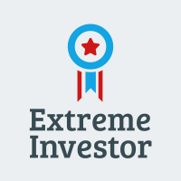

<!-- PROJECT SHIELDS -->
<!--
*** I'm using markdown "reference style" links for readability.
*** Reference links are enclosed in brackets [ ] instead of parentheses ( ).
*** See the bottom of this document for the declaration of the reference variables
*** for contributors-url, forks-url, etc. This is an optional, concise syntax you may use.
*** https://www.markdownguide.org/basic-syntax/#reference-style-links
-->
[![Contributors][contributors-shield]][contributors-url]
[![Forks][forks-shield]][forks-url]
[![Stargazers][stars-shield]][stars-url]
[![Issues][issues-shield]][issues-url]
[![MIT License][license-shield]][license-url]
[![LinkedIn][linkedin-shield]][linkedin-url]

<!-- PROJECT LOGO -->
 

  

<h3 align="center">Asset Rebalancing Calculator</h3>
  This app calculates how much of a new deposit, to invest in each asset,  
  in order to keep your portfolio as balanced as possible.
  

     
    <a href="https://github.com/dannissim/asset-rebalancing-calculator/issues">Report Bug</a>
    ·
    <a href="https://github.com/dannissim/asset-rebalancing-calculator/issues">Request Feature</a>
  

<!-- ABOUT THE PROJECT -->
## About The Project
Suppose you have a self-managed portfolio, and each month you add a portion of your income to your portfolio.
Suppose as well that you have a target asset allocation. For example:  
| Asset | Target Allocation |
|-------|-------------------|
| VTI   | 64%               |
| VXUS  | 16%               |
| BND   | 20%               |
Using this app you will know how much of each asset to invest in order to be as close as possible 
to your target allocation - without selling any of your current assets.

(<a href="#top">back to top</a>)

### Built With

* [Python 3.9](https://python.org/)
* [Financial Modeling Prep's free API](https://site.financialmodelingprep.com/)

(<a href="#top">back to top</a>)

## Usage

[//]: # (TODO)
1. Fill `input.json` with:
   1. `target_allocation` - the percent you would like each asset to be in your portfolio.
   2. `deposit_amount` - how many dollars you are adding to your portfolio
   3. `current_market_value` - what your portfolio 
2. Add your stock list and contact info to `config.json`.
3. Create a virtual environment (optional):  
    a. `python -m venv venv`  
    b. `venv\Scripts\activate` or in linux `source venv/bin/activate`
4. install the requirements: `pip install -r requirements.txt`
5. Run `python main.py`

### What does it do?
[//]: # (TODO)
This app checks your list of stocks to see if a price has dropped significatly lower  
than its 200 day simple moving average a.k.a [SMA](https://www.investopedia.com/terms/s/sma.asp).  
When a stock price passes the threshold, you will receive an email that will notify you.

<!-- CONTRIBUTING -->
## Contributing

Contributions are what make the open source community such an amazing place to learn, inspire, and create. Any contributions you make are **greatly appreciated**.

If you have a suggestion that would make this better, please fork the repo and create a pull request. You can also simply open an issue with the tag "enhancement".
Don't forget to give the project a star! Thanks again!

1. Fork the Project
2. Create your Feature Branch (`git checkout -b feature/amazing-feature`)
3. Commit your Changes (`git commit -m 'Add some amazing feature'`)
4. Push to the Branch (`git push origin feature/amazing-feature`)
5. Open a Pull Request

(<a href="#top">back to top</a>)

<!-- LICENSE -->
## License

Distributed under the MIT License. See `LICENSE` for more information.

(<a href="#top">back to top</a>)

<!-- CONTACT -->
## Contact

Dan Nissim - nissim.dan@gmail.com

Project Link: [https://github.com/dannissim/asset-rebalancing-calculator](https://github.com/dannissim/asset-rebalancing-calculator)

(<a href="#top">back to top</a>)

<!-- MARKDOWN LINKS & IMAGES -->
<!-- https://www.markdownguide.org/basic-syntax/#reference-style-links -->
[contributors-shield]: https://img.shields.io/github/contributors/dannissim/asset-rebalancing-calculator.svg?style=for-the-badge
[contributors-url]: https://github.com/dannissim/asset-rebalancing-calculator/graphs/contributors
[forks-shield]: https://img.shields.io/github/forks/dannissim/asset-rebalancing-calculator.svg?style=for-the-badge
[forks-url]: https://github.com/dannissim/asset-rebalancing-calculator/network/members
[stars-shield]: https://img.shields.io/github/stars/dannissim/asset-rebalancing-calculator.svg?style=for-the-badge
[stars-url]: https://github.com/dannissim/asset-rebalancing-calculator/stargazers
[issues-shield]: https://img.shields.io/github/issues/dannissim/asset-rebalancing-calculator.svg?style=for-the-badge
[issues-url]: https://github.com/dannissim/asset-rebalancing-calculator/issues
[license-shield]: https://img.shields.io/github/license/dannissim/asset-rebalancing-calculator.svg?style=for-the-badge
[license-url]: https://github.com/dannissim/asset-rebalancing-calculator/blob/master/LICENSE.txt
[linkedin-shield]: https://img.shields.io/badge/-LinkedIn-black.svg?style=for-the-badge&logo=linkedin&colorB=555
[linkedin-url]: https://linkedin.com/in/dan-nissim-2558a785
[product-screenshot]: images/screenshot.png